# MCMP Chatbot Housekeeping Workflow

This file is this repository's instance of `content/templates/HOUSEKEEPING_TEMPLATE.md` in the knowledge base. Run it every 2–4 weeks, before any deploy, and after any non-trivial change to `src/core/engine.py`, `src/mcp/`, the system prompt, the Gemini model/parameters, `firebase/backend/`, or `firebase/frontend/`.

What it protects: the live app at `mcmp-chat.ignacioojea.com` — a Next.js frontend on App Hosting proxying to a FastAPI backend on Cloud Run, which answers through Gemini with MCP tools over Firestore data. Most regressions here are (a) the model choosing the wrong tool or running out of tool calls, which only the live stress battery catches, (b) an image or build that no longer builds from `uv.lock` / `package-lock.json`, and (c) stale Firestore data after a failed scrape.

**Execution model:** sequential — each phase has an exit criterion; the run advances only when the prior phase is green or its drift is recorded.

> **The deterministic checks are bundled in `bin/housekeeping-checks.sh`.** One command, one summary table, `OVERALL: PASS|FAIL`. Its header lists what it covers and what stays an agent step.

**Prerequisites:**
- Docker daemon running (OrbStack on the maintainer's Mac). Python steps run inside the backend image because `uv.lock` does not install on every host (`chromadb` → `onnxruntime` has no macOS x86_64 wheel). `HK_PY_MODE=host` forces the local `.venv` instead.
- `uv` and `uvx` on `PATH`; `npm ci` done in `firebase/frontend/`.
- `GEMINI_API_KEY` in `.env` (the tests and stress battery load it via `python-dotenv`; with no key the live Gemini tests skip).
- `gcloud auth application-default login` as the `mcmp-firebase` owner, for the read-only Firestore check in Phase 4.
- `cps_admin_mcp` connected, for filing follow-ups as tasks (`task.mcmp_chatbot.<area>.<name>`).

---

## Flow

```mermaid
flowchart TD
    P1["Phase 1: Context Load"]
    P2["Phase 2: Static Quality Checks"]
    P3["Phase 3: Tests + Gemini Stress Battery"]
    P4["Phase 4: Build, Dependency & Data Health"]
    P5["Phase 5: Report & Close"]
    End([end])
    P1 --> P2 --> P3 --> P4 --> P5 --> End
```



---

## JSONL Logs

The archive lives at `housekeeping_log.jsonl` at the repo root — append-only, one JSON record per line, oldest first. The schema is the template's `schema_version: 1` contract:

| Field | Type | Notes |
|:--|:--|:--|
| `schema_version` | int | `1` |
| `entry_id` | string | `YYYY-MM-DD`; same-day collisions append `-1`, `-2`, … |
| `date` | string | ISO run date |
| `trigger` | string | The Latest Report's `**Trigger:**` line |
| `metrics` | object | The Latest Report's YAML block as a JSON dict |
| `body_markdown` | string | The `### Notable` / `### Outstanding` prose only; `""` on a clean run |

Append inline (no helper script):

```bash
python3 - <<'PY' >> housekeeping_log.jsonl
import json
rec = {"schema_version": 1, "entry_id": "YYYY-MM-DD", "date": "YYYY-MM-DD",
       "trigger": "...", "metrics": {...}, "body_markdown": ""}
print(json.dumps(rec, ensure_ascii=False))
PY
```

Render for review: `jq -r '"## \(.entry_id)\n\n**Trigger:** \(.trigger)\n\n\(.body_markdown)\n"' housekeeping_log.jsonl | tail -200`

---

## Phase 1 — Context Load

1. Read `## Latest Report` below: previous test counts, stress-battery result and latency, Firestore counts, open follow-ups.
2. Check what changed since that date: `git log --oneline --since=<date>` and open tasks via `cps_query(entity="task", repo="mcmp_chatbot", status="todo")`.
3. Confirm the prerequisites above (`docker info`, `ls firebase/frontend/node_modules`, key present in `.env`).

**Exit criterion:** baseline loaded; changes since the last run identified; environment ready.

---

## Phase 2 — Static Quality Checks

Covered by `bin/housekeeping-checks.sh`:

| Step | Command | Gate |
|:--|:--|:--|
| Python lint | `uvx ruff check --isolated --select F src firebase scripts tests` | pyflakes rules only — correctness, not style |
| Frontend types | `cd firebase/frontend && npx tsc --noEmit` | zero errors |
| Frontend lint | `cd firebase/frontend && npm run lint` | zero errors/warnings |

**Remediation:** fix in source. Do not silence with `# noqa` / `eslint-disable` unless the disable is justified in the same change.

**Exit criterion:** all three clean.

---

## Phase 3 — Tests + Gemini Stress Battery

### Step 1 — pytest (script)

`bin/housekeeping-checks.sh` runs `pytest tests/` inside the freshly built backend image with the repo mounted. Suites: engine (OpenAI-mocked), MCP tools, graph correctness, scraper, vector store, backend endpoints (`test_backend.py`, Firestore and token verification faked), and live Gemini integration (`test_gemini.py`, skipped without a key).

Compare counts with the prior report: a new failure, a new skip, or a smaller total without a stated reason is a finding.

### Step 2 — Gemini stress battery (agent step: live API, spends quota)

```bash
mkdir -p tests/reports
docker build -q -f firebase/backend/Dockerfile -t mcmp-backend:housekeeping .
docker run --rm -v "$PWD":/repo -w /repo mcmp-backend:housekeeping \
  python -m tests.stress_test_gemini > tests/reports/stress_$(date -u +%Y-%m-%d).log 2>&1
docker rmi mcmp-backend:housekeeping
```

13 cases cover every MCP tool (`search_people`, `search_research`, `get_events`, `search_graph`, `search_academic_offerings`, `grep_data`, `fuzzy_search`), multi-tool chains, the fallback cascade, missing and misspelled names, and date formatting. The harness exits 0 only if every case passes. Transcripts are gitignored (`*.log`); keep the three most recent.

**Interpreting results:**
- One or two transient `429`/`503` that recover on retry — acceptable; note the count.
- Repeatable `FAIL_TOOLS` — wrong tool chosen: check the TOOL SELECTION GUIDE in `src/core/engine.py` and the tool `description`s in `src/mcp/server.py`.
- Repeatable `FAIL_RESPONSE_ERROR`, or an empty/`None` answer — the engine swallowed an exception or automatic function calling hit `maximum_remote_calls` with no final text; the live `/chat` (streaming path) then shows an empty answer.
- Average latency drift > 25% vs. the prior report — investigate (thinking tokens re-enabled, longer tool chains, model slowdown).

**Exit criterion:** pytest green with counts steady or higher; stress battery 13/13, or every failure characterized and filed.

---

## Phase 4 — Build, Dependency & Data Health

### Step 1 — Script-covered checks

| Step | What | Gate |
|:--|:--|:--|
| `uv_lock` | `uv lock --check` — lock matches `pyproject.toml` | gate |
| `backend_image` | `docker build -f firebase/backend/Dockerfile .` — the exact image Cloud Run runs | gate |
| `fe_build` | `npm run build` — the build App Hosting runs | gate |
| `tracked_files` | no `.env`, SA keys, `secrets.toml`, `data/`, `.next/`, logs, `__pycache__` tracked or staged (the repo is public) | gate |
| `npm_audit` | `npm audit --omit=dev` | info |

The scraper image (`firebase/scraper/Dockerfile`) shares `uv.lock` with the backend image but adds Chromium; it is not built here.

### Step 2 — Live data freshness (agent step, read-only)

Production reads Firestore, not `data/`. Check counts and the last scrape:

```bash
uv run --quiet --no-project --with google-cloud-firestore python - <<'EOF'
from google.cloud import firestore
db = firestore.Client(project="mcmp-firebase")
for c in ["people", "research", "events", "academic_offerings"]:
    print(c, db.collection(c).count().get()[0][0].value)
logs = db.collection("meta").document("scraping_logs").get().to_dict()["data"]
print("last scrape:", (logs[-1] if isinstance(logs, list) else logs).get("timestamp"))
EOF
```

The dataset accumulates, so counts only grow; a drop is a regression. A last scrape older than ~7 days means both refreshers (the cloud routine and the `mcmp-firebase-scraper` Cloud Run Job, Mon/Thu 03:00 UTC) have failed; see `docs/` for their runbooks.

### Step 3 — Documentation freshness

- `README.md` and `docs/MCMPCHAT_*` still name the real endpoints, secrets, and deploy commands.
- Open tasks for `mcmp_chatbot` that describe finished work are closed.

**Exit criterion:** gates green; data fresh with counts steady or higher; docs match the code.

---

## Phase 5 — Report & Close

1. Replace `## Latest Report` below with this run's report (template at the bottom).
2. Append the same run to `housekeeping_log.jsonl` (§ JSONL Logs).
3. File anything found and not fixed as a task through `cps_admin_mcp` — findings must not live only in this report.
4. Set `last_checked` in the frontmatter to today (UTC).

**Exit criterion:** report and log line written, follow-ups filed, `last_checked` bumped, and `bin/housekeeping-checks.sh` ends `OVERALL: PASS` (its `log_integrity` step validates the new line).

---

## Quick Reference — Housekeeping Checklist

```text
[ ] bin/housekeeping-checks.sh — OVERALL: PASS
[ ] Phase 1: baseline read; changes since last run listed; env ready
[ ] Phase 2: ruff (F), tsc, next lint — clean
[ ] Phase 3: pytest green, counts steady+; stress battery 13/13, transcript in tests/reports/
[ ] Phase 4: lock, backend image, next build, tracked files — green; Firestore fresh, counts steady+; docs match
[ ] Phase 5: Latest Report replaced; log line appended; follow-ups filed; last_checked bumped
```

---

## Latest Report

**Date:** 2026-09-29 (second run)
**Trigger:** Post-model-swap — Gemini key moved to mcmp-firebase, forcing gemini-3.8-flash.

```yaml
lint:          { python_F: 0, frontend: 0 }
types:         ok
tests:         { passed: 35, failed: 0, skipped: 0 }
stress:        { passed: 13, total: 13, avg_latency_s: 8.65, transient_retries: 0, model: gemini-3.8-flash }
lock:          ok
backend_image: ok
fe_build:      ok
tracked_files: ok
npm_audit:     4 advisories (1 critical, 2 high, 1 moderate)
data:          { people: 83, research: 4, events: 151, academic_offerings: 5, last_scrape: 2026-09-28 }
docs:          ok
```

### Notable

- **Model swap gemini-2.5-flash → gemini-3.8-flash**, forced by moving the Gemini key from the legacy `mcmp-chatbot` project into `mcmp-firebase`: Google serves 2.5-flash only to projects that already used it ("no longer available to new users").
- **3.8-flash searches longer.** It takes up to 5 tool rounds on ordinary questions and keeps searching when the data lacks the answer (9 rounds on the PhD-contacts case), so the old cap of 5 ended turns with no text. The engine now forces a final answer with tools disabled when `MAX_TOOL_ROUNDS` (now 10) runs out; streaming falls back to the non-streaming path, since the streaming chat does not expose the tool trail. 3 unit tests added.
- **Latency 3.45s → 8.65s average** (range 3–19s), the cost of 3.8-flash's longer tool chains.
- The stray `s` appended to the key in `.env` caused a 401 (OAuth error); fixed from Secret Manager v2.

### Outstanding

- `task.mcmp_chatbot.frontend.next-security-upgrade` — Next.js 14.2 has a critical advisory; the fix needs next@16.

---

## Latest Report Template

A clean run is ~15 lines; drop `### Notable` / `### Outstanding` when there is nothing to say.

````markdown
## Latest Report

**Date:** {{YYYY-MM-DD}}
**Trigger:** {{routine cadence | pre-deploy | post-change | post-incident}}

```yaml
lint:          { python_F: N, frontend: N }
types:         ok | N errors
tests:         { passed: N, failed: N, skipped: N }
stress:        { passed: N, total: 13, avg_latency_s: X.XX, transient_retries: N }
lock:          ok | out of sync
backend_image: ok | <failure cause>
fe_build:      ok | <failure cause>
tracked_files: ok | N forbidden
npm_audit:     ok | N advisories
data:          { people: N, research: N, events: N, academic_offerings: N, last_scrape: YYYY-MM-DD }
docs:          ok | N drift items
```

### Notable

{{Omit on clean runs.}}

### Outstanding

{{Omit when empty; task slugs filed this run.}}
````
