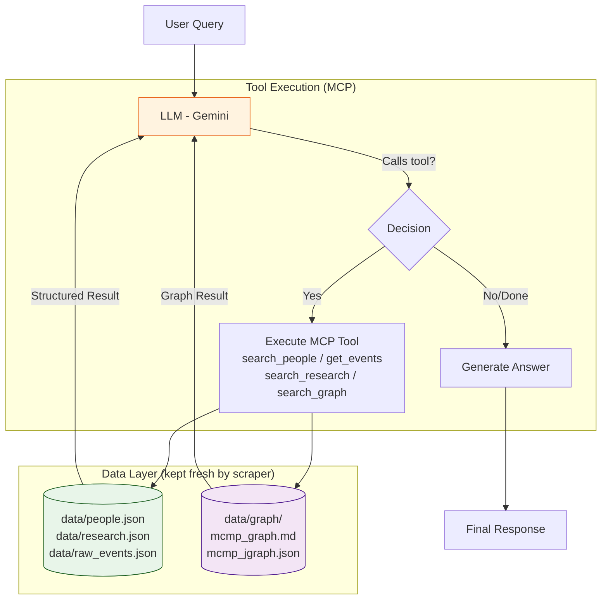

# MCMP Chatbot

- status: active
- type: explanation
- description: Overview, setup guide, and technical architecture reference for the MCMP Chatbot application.

<!-- content -->

A structured-data chatbot for the **Munich Center for Mathematical Philosophy (MCMP)**. This application scrapes the MCMP website for the latest events, people, and research, and uses an LLM (Google Gemini) with structured MCP tools to answer user queries about the center's activities.

The application is built with **Streamlit** for the frontend, uses **JSON data files** for structured storage, and integrates with **Google Sheets** for cloud-based feedback collection.

## Features

- **Activity QA**: Ask about upcoming talks, reading groups, and events.
- **Automated Scraping**: Keeps data fresh by scraping the MCMP website.
- **Rich Metadata Extraction**: Automatically extracts detailed profile information including emails, office locations, hierarchical roles, and publication lists.
- **Structured Data Tools (MCP)**: Implements an in-process Model Context Protocol (MCP) server that exposes `people.json`, `research.json`, and `raw_events.json` as structured tools. This allows the LLM to perform precise queries (e.g., "List all events next week", "Who researches Logic?").
- **Cloud Database (Feedback)**: User feedback is automatically saved to a Google Sheet for persistent, cloud-based storage (with a local JSON fallback).
- **Multi-LLM Support**: Configured to work seamlessly with **Google Gemini**, but also supports OpenAI and Anthropic.
- **Institutional Graph**: Uses a graph-based layer (`data/graph`) to understand organizational structure (Chairs, Leadership) while linking people to hierarchical **Research Topics**.
- **Configurable Personality (Leopold)**: The chatbot's personality is defined in `prompts/personality.md`, separating tone and identity from code. Edit the file to adjust behavior without touching the engine.
- **Agentic Workflow**: Follows the `AGENTS.md` and `docs/MD_CONVENTIONS.md` protocols for AI-assisted development.

## Architecture

The system answers queries through two complementary mechanisms:

1. **Web Scraping → JSON Data**: `scripts/update_dataset.py` scrapes the MCMP website and stores structured data in `data/people.json`, `data/research.json`, and `data/raw_events.json`. It also builds the Institutional Graph (`data/graph/`).
2. **MCP Structured Tools**: The LLM uses an in-process MCP server (`src/mcp/`) to query those JSON files precisely. Tools like `search_people`, `search_research`, and `get_events` let the model answer structured questions (e.g., "Who is presenting next Tuesday?") without relying on fuzzy text retrieval.

## Setup

1. **Clone the repository**:
   ```bash
   git clone <repository-url>
   cd mcmp_chatbot
   ```

2. **Install dependencies**:
   ```bash
   pip install -r requirements.txt
   ```

3. **Configure Secrets**:
   Create a `.streamlit/secrets.toml` file with your API keys.

   **For Google Gemini (Recommended):**
   - Get your API key from [Google AI Studio](https://aistudio.google.com/).
   ```toml
   GEMINI_API_KEY = "your-google-gemini-key"
   ```
   > [!NOTE]
   > The `GEMINI_API_KEY` determines where the LLM usage is billed. This is often a different Google Cloud project (e.g., `gen-lang-client...`) than the Service Account used for Sheets. To consolidate billing, link your API key to the `mcmp-chatbot` project in Google AI Studio.

   **For Cloud Feedback (Google Sheets):**
   - Create a project in [Google Cloud Console](https://console.cloud.google.com/).
   - Enable the [Google Sheets API](https://console.cloud.google.com/apis/library/sheets.googleapis.com) and [Google Drive API](https://console.cloud.google.com/apis/library/drive.googleapis.com).
   - Create a Service Account and download the JSON key.
   ```toml
   [gcp_service_account]
   type = "service_account"
   project_id = "..."
   private_key = "..."
   client_email = "..."
   # ... (other standard GCP credentials)
   sheet_name = "MCMP Feedback"
   ```

4. **Run the Application**:
   ```bash
   streamlit run app.py
   ```

## Data Maintenance
To keep the chatbot up to date with the latest MCMP events and personnel, run the update protocol:

```bash
python scripts/update_dataset.py
```
This script will:
1.  Scrape the MCMP website (Events, People, Research).
2.  **Accumulate** JSON datasets (`data/*.json`) — existing entries are updated or kept; **entries are never removed**.
3.  **Enrich Metadata**: Run internal utilities to extract structured metadata (dates, roles) from text descriptions.
4.  Rebuild the Institutional Graph (`data/graph/mcmp_graph.md` and `mcmp_jgraph.json`).

> [!IMPORTANT]
> **Accumulation, not replacement.** The datasets grow monotonically. If an event disappears from the website (e.g. dynamic "Load more" button not triggered, or the event page is taken down), the entry is still preserved in the JSON file. The `scraping_logs.json` `"removed"` field records what was absent in the current scrape but does **not** reflect a deletion from the dataset.

## Technical Architecture

### 1. Frontend: Streamlit
The user interface is built entirely in **Streamlit**, providing a clean, responsive chat interface. It handles user sessions, admin access (password protected), and feedback forms directly in the browser.

#### Native Streamlit Calendar UI
Streamlit limits raw HTML `<a href="...">` links from natively triggering backend Python callbacks securely without hard page reloads. To maintain our premium presentation while preserving instant conversational injections, the application uses a **Pure Native Calendar UI**:
- The calendar grid is dynamically constructed using strictly native `st.columns` and `st.button` components to ensure perfect layout alignment and fast, socket-driven session behavior.
- We map Streamlit's built-in button types to represent different states: `type="primary"` (Today), `type="secondary"` (Normal/Event Day), and `type="tertiary"` (Empty padding to maintain grid shape).
- Event days are visually indicated natively using standard Unicode emojis (`🔵`) appended to the button text string, removing the need for complex and fragile DOM-breaking CSS injections.
- We target these specific built-in component types using scoped CSS pseudo-selectors (like `[data-testid="column"] button`) injected via `st.markdown(unsafe_allow_html=True)`. This cleanly overrides standard padding and sizing (using `!important` tags and uniform background styles) to create a perfectly square, tight, and consistent grid without breaking Streamlit's strict React DOM behavior.
- Clicking a date silently injects a hidden prompt ("What events are scheduled for X?") into the chat sequence, triggering real-time MCP tool calls directly within the existing chat viewer.

### 2. AI Engine: Google Gemini
The core logic (`src/core/engine.py`) connects to the **Gemini API** (or others) to generate responses. It offers the model a set of MCP tools; the model decides whether and how to call them based on the user's query.

### 3. Data Storage
- **JSON Data Files**: Scraped content is stored as structured JSON in `data/people.json`, `data/research.json`, and `data/raw_events.json`. These are the source of truth queried by the MCP tools.
- **Institutional Graph**: Organizational relationships are stored in `data/graph/mcmp_graph.md` and `data/graph/mcmp_jgraph.json`, parsed by `src/core/graph_utils.py` for context injection.
- **Cloud Feedback**: User feedback is pushed to **Google Sheets** via the Google Drive API, acting as a cloud database for ongoing user data collection.

### 4. Data Model & Relationships
The system connects four key data types to answer complex questions:
1.  **People** (`data/people.json`): Comprehensive profiles including bios, contact details (email, phone, office), organizational roles, and selected publications.
2.  **Research** (`data/research.json`): Hierarchical structure of research areas (e.g., Logic, Philosophy of Science) and their subtopics, with automated linking to people.
3.  **Events** (`data/raw_events.json`): Upcoming talks and workshops.
4.  **Institutional Graph** (`data/graph/mcmp_graph.md`): A knowledge graph that links **People** to **Organizational Units** (Chairs) and defines hierarchy (e.g., who leads a chair, who supervises whom).

**How they interact:**
- When a user asks "Who works at the Chair of Philosophy of Science?", the **Graph** identifies the Chair entity and its `affiliated_with` edges.
- The system then retrieves detailed profiles from **People** data via the `search_people` MCP tool.
- If the user asks "What does Ignacio Ojea research?", the `search_people` tool returns his full profile including linked **Research Topics**.

### 5. MCP Integration (Structured Data)
To handle specific queries that require structured data access (e.g., "Which events are happening between date X and Y?"), the system implements a lightweight **MCP Server** (`src/mcp/`).
- **Tools**: Exposes Python functions (`search_people`, `search_research`, `get_events`, `search_graph`) as tools to the LLM.
- **Execution**: The engine offers these tools to the LLM. If the LLM determines it needs data, it calls the tool, and the result is fed back for the final answer.
- **Toggle**: This feature can be enabled/disabled via the Streamlit sidebar to manage latency and costs.
*(See `docs/MCP_AGENT.md` for full implementation details)*

### 6. Advanced Logic (Prompt Engineering)
To ensure reliable tool usage, the system implements:
- **Dynamic Injection**: Tools are explicitly listed in the system prompt.
- **Force Usage**: Imperative commands ("Just check") prevent the LLM from asking for permission.
- **Data Enrichment**: If context is partial (e.g., missing abstracts), the LLM is mandated to use tools to fetch full details.

## Query Processing Pipeline

This diagram illustrates how the system combines **Scraping (Data Freshness)**, **Graph (Relationships)**, and **MCP (Structured Queries)** to answer a user query.



### Explanation of the Flow
1.  **User Query**: The user asks a question in Streamlit.
2.  **LLM Evaluation**: The LLM receives the query and a list of available MCP tools.
3.  **Tool Calls** (if needed):
    *   **Scenario A (Simple Query)**: The LLM answers from its general knowledge + graph context injected in the system prompt.
    *   **Scenario B (Needs Structured Data)**: The LLM calls a tool (e.g., `get_events(query="next week")`). The system executes this against the **JSON Data Files** and feeds the precise result back.
4.  **Final Answer**: The LLM synthesizes tool outputs and graph context into the final response.

### Example Walkthrough

**Query:** *"What is Hannes Leitgeb working on and what are his upcoming events?"*

1.  **LLM receives query** with the available MCP tools listed.

2.  **Tool Call 1 — `search_people`**:
    *   The LLM calls: `search_people(query="Hannes Leitgeb")`
    *   *Result*: Full profile — research areas, publications, office details.

3.  **Tool Call 2 — `get_events`**:
    *   The LLM calls: `get_events(query="Hannes Leitgeb")`
    *   *Result*: `[{"title": "Talk at LMU", "date": "2024-10-15", ...}]`

4.  **Final Synthesis**:
    > "Hannes Leitgeb is currently working on Logic and Probability (from `search_people`). He leads the Chair of Logic and Philosophy of Language (from Graph). Regarding his schedule, he has an upcoming talk at LMU on October 15th (from `get_events`)."

## Project Structure

```
mcmp_chatbot/
├── app.py                # Main Streamlit application entry point
├── src/
│   ├── core/             # AI engine (Gemini), Graph utils, Personality loader
│   ├── mcp/              # MCP Tools and Server implementation
│   ├── scrapers/         # Scrapers for MCMP website
│   ├── ui/               # Streamlit UI components
│   └── utils/            # Helper functions (logging, etc.)
├── prompts/              # Chatbot personality configuration
│   └── personality.md    # Leopold's identity, tone, and guidelines
├── data/                 # Local data storage (JSONs, Graph)
│   ├── people.json
│   ├── research.json
│   ├── raw_events.json
│   └── graph/            # Institutional graph (md + json)
├── docs/                 # Project documentation and proposals
│   ├── MCP_AGENT.md
│   ├── HOUSEKEEPING.md   # Maintenance protocols
│   ├── PERSONALITY_AGENT.md
│   └── MD_CONVENTIONS.md # Markdown conventions
├── scripts/              # Maintenance and update scripts
│   └── update_dataset.py # Main data update script
├── tests/                # Unit and integration tests
├── AGENTS.md             # Guidelines for AI Agents
└── requirements.txt      # Python dependencies
```

## Agentic Workflow

This project uses a structured workflow for AI agents.
- **AGENTS.md**: Read this first if you are an AI assistant.
- **docs/MD_CONVENTIONS.md**: Defines the schema for Markdown files and task management.
