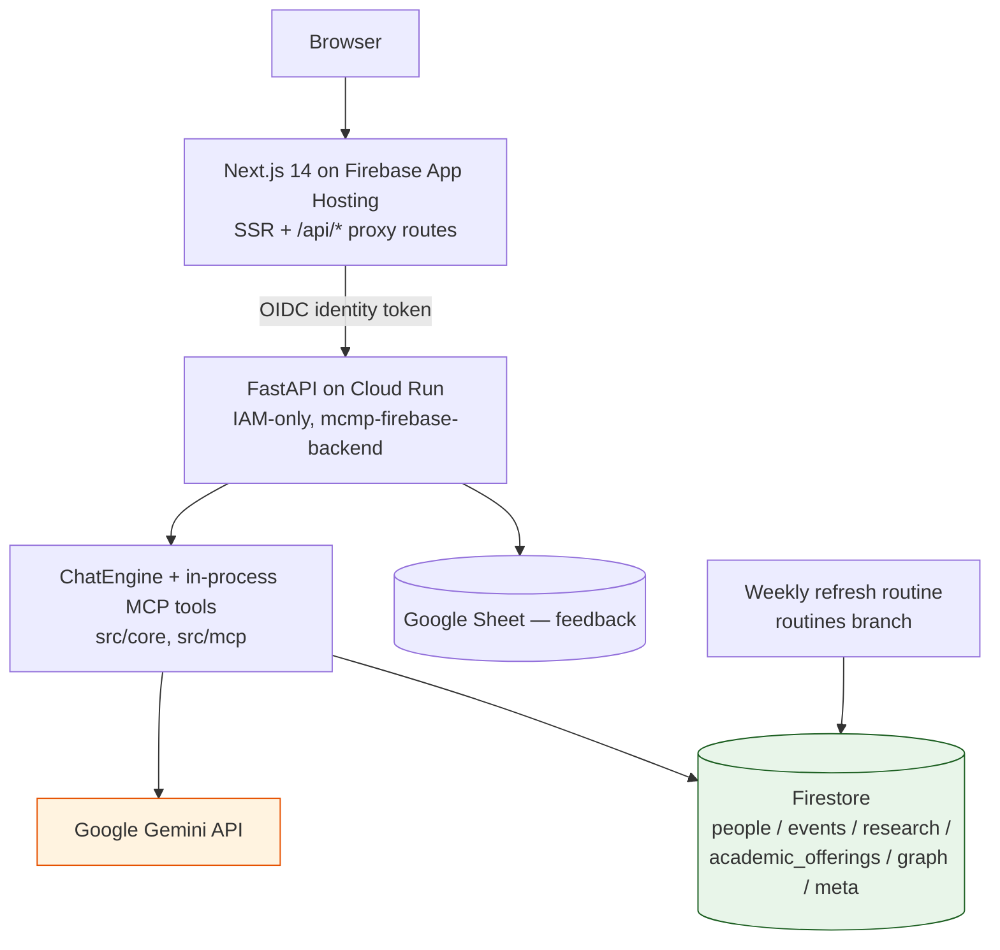

# MCMP Chatbot

- status: active
- type: explanation
- description: Overview, setup guide, and architecture reference for the MCMP Chatbot — a Next.js + FastAPI + Firestore application deployed on Firebase.

<!-- content -->

A structured-data chatbot for the **Munich Center for Mathematical Philosophy (MCMP)**. It scrapes the MCMP website for the latest events, people, and research, stores the data in **Firestore**, and uses an LLM (Google Gemini) with structured MCP tools to answer questions about the center's activities.

**Live:** https://mcmp-chat.ignacioojea.com (custom domain; the auto-generated `https://mcmp-chatbot--mcmp-firebase.us-east4.hosted.app` also still works)

The production application is built as a **Firebase stack**: a **Next.js 14** frontend on **Firebase App Hosting**, calling a **FastAPI backend on Cloud Run** (IAM-only), backed by **Firestore**. The backend wraps a shared Python core (`src/`) — the AI engine, the in-process MCP tools, and the scrapers — that is reused unchanged from the project's earlier Streamlit incarnation. The Streamlit UI (`app.py`, `src/ui/`) has been retired; the engine it used lives on in `src/core/`.

> **Branches.** `firebase-branch` is the production deploy source (App Hosting auto-deploys from it; the backend deploy script refuses any other branch). `routines` is `firebase-branch` plus the data-refresh machinery — see [Data & the refresh routine](#data--the-refresh-routine).

## Features

- **Activity QA**: Ask about upcoming talks, reading groups, and events.
- **Academic Offerings QA**: Ask about degree programs (Bachelor, Master, PhD), application requirements, deadlines, and coordinators.
- **Interactive calendar**: A month calendar with event-day dots and click-to-query — clicking a day injects a prompt asking about that day's events.
- **Events This Week**: A sidebar list of the current week's talks (speaker, title, time, location), linked to the MCMP event pages.
- **Structured Data Tools (MCP)**: An in-process Model Context Protocol server exposes the Firestore-backed data as precise query tools, so the LLM can answer structured questions (e.g. "List all events next week", "Who researches Logic?") without fuzzy text retrieval.
- **Typo-tolerant name search**: A `fuzzy_search` tool (stdlib `difflib` edit-distance) and a fuzzy fallback inside `search_people` resolve misspelled names — e.g. a query for "Tom Sternkenberg" still surfaces "Tom F. Sterkenburg" instead of "no results".
- **Institutional Graph**: A graph layer captures organizational structure (Chairs, Leadership) and links people to hierarchical **Research Topics**.
- **Configurable Personality (Leopold)**: The chatbot's identity and tone live in `prompts/personality.md`, separate from code.
- **Feedback**: User feedback is appended to a Google Sheet via the backend.
- **Admin panel** (`/admin`): Google sign-in gated by an email allowlist; triggers a manual scrape and links to the feedback sheet.

## Architecture


```mermaid
graph TD
    User[Browser] --> FE[Next.js 14 on Firebase App Hosting<br/>SSR + /api/* proxy routes]
    FE -- "OIDC identity token" --> BE[FastAPI on Cloud Run<br/>IAM-only, mcmp-firebase-backend]
    BE --> Engine[ChatEngine + in-process MCP tools<br/>src/core, src/mcp]
    Engine --> Gemini[Google Gemini API]
    Engine --> FS[(Firestore<br/>people / events / research /<br/>academic_offerings / graph / meta)]
    BE --> Sheets[(Google Sheet — feedback)]
    Scraper[Weekly refresh routine<br/>routines branch] --> FS

    style FS fill:#e8f5e9,stroke:#1b5e20
    style Gemini fill:#fff3e0,stroke:#e65100
```

- **Frontend — Next.js 14 (App Router) on Firebase App Hosting.** Server-side route handlers under `firebase/frontend/src/app/api/*` mint OIDC identity tokens with `google-auth-library` and proxy to the IAM-only backend. The browser never holds the backend credentials or the Gemini key. Chat is public; `/admin` requires Google sign-in against an email allowlist.
- **Backend — FastAPI on Cloud Run (IAM-only).** `firebase/backend/main.py` wraps the existing `ChatEngine` (`src/core/engine.py`) and MCP tools (`src/mcp/`). Endpoints: `/health`, `/chat`, `/events/month`, `/events/week`, `/feedback`, `/admin/scrape`. The Gemini key and Sheets service-account JSON are mounted from Secret Manager. `/chat` is a blocking POST in v1 (no SSE streaming yet).
- **Data — Firestore.** With `DATA_BACKEND=firestore`, the MCP tools load the `people`, `events`, `research`, `academic_offerings`, `graph`, and `meta` collections into memory at startup via the Firebase Admin SDK (which bypasses security rules; client access is locked off). Setting `DATA_BACKEND=json` instead reads the local `data/*.json` files — the path used for local development.

## Repository layout

```
mcmp_chatbot/
├── firebase/
│   ├── frontend/          # Next.js 14 App Router (Firebase App Hosting)
│   │   ├── src/app/       # pages + /api/* server-side proxy routes
│   │   ├── src/components/ # ChatPanel, CalendarWidget, EventsThisWeek, FeedbackForm
│   │   ├── src/lib/        # firebase init, backend client, types
│   │   └── apphosting.yaml
│   ├── backend/           # FastAPI on Cloud Run
│   │   ├── main.py
│   │   ├── Dockerfile      # builds from repo root to COPY src/ + prompts/
│   │   ├── cloudbuild.yaml
│   │   ├── deploy-backend.sh
│   │   └── requirements.txt
│   └── scripts/
│       └── migrate_to_firestore.py   # one-time / re-run JSON → Firestore upsert
├── src/                   # Shared Python core (reused by the backend)
│   ├── core/              # ChatEngine (Gemini), graph utils, personality loader
│   ├── mcp/               # MCP tools + server (Firestore- or JSON-backed)
│   ├── scrapers/          # MCMP website scraper
│   └── utils/             # graph builder, metadata extractor, logging
├── prompts/personality.md # Leopold's identity, tone, guidelines
├── data/                  # Local JSON datasets (used when DATA_BACKEND=json; gitignored here)
├── scripts/update_dataset.py  # Local scrape → JSON (legacy / dev)
├── docs/
│   ├── FIREBASE_MIGRATION_PLAN.md  # Full architecture, GCP IDs, phase-by-phase plan
│   └── MCMP_SCRAPING_REF.md
├── tests/
└── requirements.txt       # Python deps for the shared core + local dev
```

## Local development

### Backend (FastAPI)

Runs against local JSON data — no Firestore or GCP access needed.

```bash
pip install -r requirements.txt
cd firebase/backend
GEMINI_API_KEY=<your-key> DATA_BACKEND=json uvicorn main:app --reload --port 8080

# smoke test
curl http://localhost:8080/health
curl -X POST http://localhost:8080/chat \
  -H "Content-Type: application/json" \
  -d '{"message":"Who is Hannes Leitgeb?","history":[]}'
```

Get a Gemini API key from [Google AI Studio](https://aistudio.google.com/).

### Frontend (Next.js)

```bash
cd firebase/frontend
nvm use 20          # App Hosting buildpack requires Node 20
npm install
npm run dev         # http://localhost:3000
```

The frontend proxy routes need `BACKEND_URL` to point at a reachable backend (your local `http://localhost:8080`, or the deployed Cloud Run URL with credentials). Public-by-design config (`NEXT_PUBLIC_FB_API_KEY`, `NEXT_PUBLIC_ALLOWED_ADMIN_EMAILS`) lives in `firebase/frontend/apphosting.yaml`.

## Deployment

All deploys run from `firebase-branch`.

**Backend → Cloud Run:**

```bash
git checkout firebase-branch
./firebase/backend/deploy-backend.sh   # hard branch guard; builds via Cloud Build, deploys, smoke-tests /health
```

**Frontend → Firebase App Hosting:** push to `firebase-branch`; App Hosting auto-detects the push and rolls out a new build. Production is served at the custom domain `mcmp-chat.ignacioojea.com` (auto-URL `mcmp-chatbot--mcmp-firebase.us-east4.hosted.app` also works). Custom-domain setup is documented in [docs/MCMPCHAT_CUSTOM_DOMAIN_WORKFLOW.md](docs/MCMPCHAT_CUSTOM_DOMAIN_WORKFLOW.md).

Key infrastructure (full details in [docs/FIREBASE_MIGRATION_PLAN.md](docs/FIREBASE_MIGRATION_PLAN.md)):

| Resource | Value |
|:---|:---|
| GCP project | `mcmp-firebase` |
| Cloud Run backend | `mcmp-firebase-backend` (us-central1, IAM-only) |
| App Hosting backend | `mcmp-chatbot` (us-east4) |
| Firestore | default database, `nam5` |
| Runtime service account | `mcmp-firebase-app-sa@mcmp-firebase.iam.gserviceaccount.com` |
| Secrets (Secret Manager) | `GEMINI_API_KEY`, `SHEETS_SA_JSON`, `SHEETS_ID` |

## Data & the refresh routine

The live app reads **Firestore**, not the JSON files — so a scrape only updates the site once its data is migrated into Firestore.

Data is kept fresh by a **weekly scheduled cloud agent** (Claude Code on the web) running on the **`routines` branch**, which is `firebase-branch` plus the refresh machinery. Each run executes `scripts/refresh_dataset.sh`, which: scrapes the MCMP site (Selenium) → commits and pushes the updated `data/*.json` to `routines` → runs `firebase/scripts/migrate_to_firestore.py` to upsert into Firestore. (`data/` is tracked only on `routines`; it is gitignored on `main`/`firebase-branch`.)

> **Security note — routine credentials live in the cloud.** This repository is **public**. The scheduled cloud agent authenticates to Firestore with a dedicated service-account key (`mcmp-firebase-app-sa@mcmp-firebase`, scoped to `roles/datastore.user` only), supplied to the job as the single-line `GCP_SA_KEY` environment variable in its Claude Code (web) trigger environment. **That key is stored on the claude.ai side, not in this repo** — no key file is committed, and `*-sa-key.json` is gitignored on every branch. Its blast radius is limited to read/write on this project's Firestore (it cannot touch the Google account, billing, IAM, or other services). If you suspect exposure, rotate it: delete and recreate the SA key, then update the `GCP_SA_KEY` env var on the trigger.

The Firestore migration is an **idempotent upsert that never deletes** — datasets accumulate, so Firestore counts run higher than any single scrape. To make the live app current manually, run the migration locally against the latest data:

```bash
gcloud auth application-default login
python firebase/scripts/migrate_to_firestore.py --project=mcmp-firebase
```

For local-only JSON refreshes (no Firestore), `scripts/update_dataset.py` scrapes the MCMP site and rebuilds `data/*.json` plus the institutional graph.

## MCP tools

The in-process MCP server (`src/mcp/`) exposes these tools to the LLM; the engine offers them on each turn and the model decides which to call:

| Tool | Purpose |
|:---|:---|
| `search_people` | Profiles: bio, contact, roles, research areas, publications. |
| `search_research` | Research areas and subtopics, with linked people. |
| `get_events` | Events by date range, type, or free-text query. |
| `search_graph` | Institutional structure — Chairs, leadership, affiliations. |
| `search_academic_offerings` | Degree programs: ECTS, deadlines, coordinators, documents. |
| `grep_data` | Substring/regex search across the raw datasets. |
| `fuzzy_search` | Typo-tolerant (edit-distance) name lookup across people, events, and research — surfaces "Tom F. Sterkenburg" for a misspelled "Tom Sternkenberg" when an exact search returns nothing. |
| `ask_clarification` | Ask the user a clarifying question when intent is ambiguous. |

## Tests

```bash
pip install -r requirements.txt
pytest tests/
```

## Documentation

- [docs/FIREBASE_MIGRATION_PLAN.md](docs/FIREBASE_MIGRATION_PLAN.md) — full architecture, GCP IDs, and the phase-by-phase migration plan.
- [docs/MCMP_SCRAPING_REF.md](docs/MCMP_SCRAPING_REF.md) — scraper reference.
- `firebase/frontend/README.md` — Next.js app notes.
