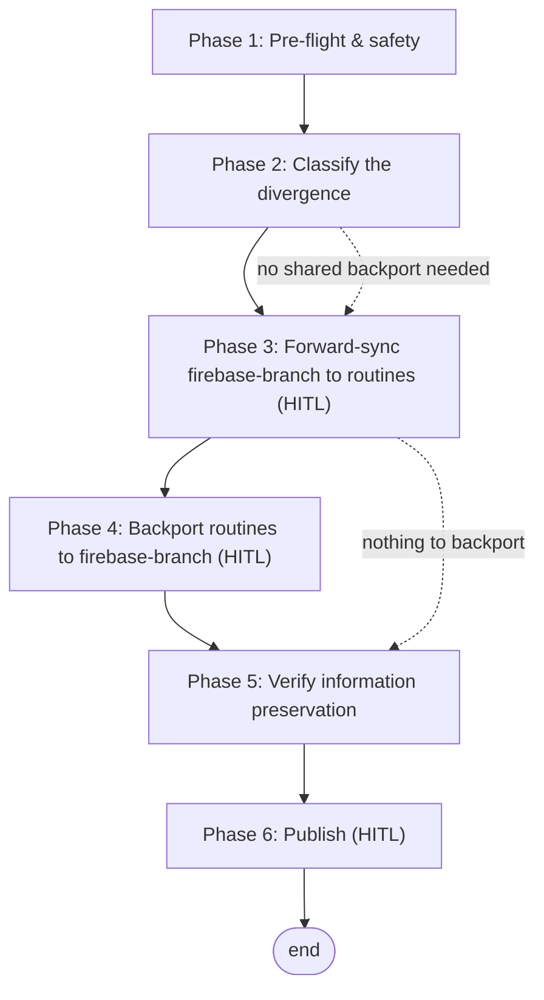

# MCMP Chatbot Branch Sync Workflow

This workflow reconciles the repository's two long-lived branches without losing information from either. `firebase-branch` is the **app-development line** (Firebase frontend/backend, feature work; `data/` is gitignored). `routines` is the **dataset-production line** (the weekly `refresh_dataset.sh` job runs only here, where `data/` is tracked and committed, then mirrored into Firestore). The branches carry genuinely different value *and* intentional, permanent policy differences — so a blind `git merge` in either direction would silently clobber tracked datasets, the `.gitignore` data-tracking rules, the cloud `.claude/settings.json`, or the SA-key ignore rules. This workflow replaces the blind merge with a **class-scoped, history-preserving** procedure: each file class has an owning branch, merges run on a throwaway sync branch, branch-local invariants are restored before commit, and information preservation is verified before anything is published. Reach for it whenever the two branches have diverged and need to be brought back into agreement.

**Execution model:** sequential — a single forward pass (pre-flight → classify → forward-sync → optional backport → verify → publish), with one conditional branch (the backport phase runs only if `routines` authored shared improvements worth propagating).

**Prerequisites:**

- A clean working tree (`git status` empty) and network access to `origin`.
- Authority to run `git push` (human-gated — see Phase 6).
- Familiarity with the dataset-refresh routine — `scripts/refresh_dataset.sh` on the `routines` branch (scrape → commit → push → Firestore upsert).
- Both branches fetched: `git fetch origin firebase-branch routines`.

**Referenced skills:** none embedded — this is a self-contained operational workflow. Related: the dataset-refresh routine driven by `scripts/refresh_dataset.sh` (routines branch).

---

## Branch ownership map

The sync is decided by **which branch owns each file class**, not by a whole-branch merge. "Owner" = the branch that is the source of truth; "Protected on" = the branch whose version must never be overwritten by a sync from the other side.

| File class | Paths | Owner (source of truth) | Sync direction | Protected invariant |
|:---|:---|:---|:---|:---|
| App / frontend / backend | `firebase/`, `prompts/`, feature code | firebase-branch | firebase-branch → routines | — |
| Scraper + dataset code | `src/scrapers/`, `scripts/update_dataset.py` | whichever authored the change | bidirectional (merge) | — |
| Routine infrastructure | `scripts/refresh_dataset.sh`, `.claude/hooks/session-start.sh`, `.claude/settings.json` | routines | routines-only (do **not** push to firebase-branch) | tracked on routines |
| Dataset | `data/*.json`, `data/graph/` | routines (+ Firestore = live mirror) | routines-only | tracked on routines, gitignored on firebase-branch |
| Branch policy | `.gitignore` | per-branch (intentionally different) | never blindly merged | data-tracking + SA-key rules differ by branch |
| Docs | `docs/`, `README.md` | shared | bidirectional (manual conflict resolution) | — |

**Branch-local invariants (must survive every sync).** These are the values a merge from the *other* branch would silently destroy; restore them before committing any merge:

- `routines` keeps its `.gitignore` (tracks `data/` and `.claude/settings.json`; does **not** re-ignore them).
- `firebase-branch` keeps its `.gitignore` (ignores `data/`; ignores `*-sa-key.json` / `mcmp-sa-key.json` / `gcp-sa-key.json` — a security rule that must never be dropped).
- `routines` keeps its tracked `data/` and cloud `.claude/settings.json` + `session-start.sh` hook.

---

## Flow



The canonical path is linear. The dotted edge from Phase 3 marks the conditional bypass: Phase 4 (backport) runs only when `routines` authored shared, non-data improvements; otherwise skip straight to verification. Three phases are human-gated: both sync directions (Phases 3 and 4) and the publish step (Phase 6).

---

## Phase 1 — Pre-flight & safety

Establish a clean, recoverable starting state. Executed by the agent; no writes to either long-lived branch happen yet.

### Step 1.1 — Clean tree and fetch

Confirm there is nothing to lose locally, then refresh both branches.

```text
git status                       # must be clean — stash or commit first if not
git fetch origin firebase-branch routines
```

If the working tree is dirty, STOP and resolve it before continuing — an unsynced local change can be silently swallowed by a merge. Note: an **untracked** file (one never committed) does not travel between branches on a switch and is easy to lose track of — commit or stash anything you mean to keep before changing branches.

### Step 1.2 — Record recovery refs

Tag the current tips so any mistake is a one-command rollback. These are throwaway local tags, not pushed.

```text
git tag sync-backup/firebase-$(date -u +%Y%m%d) origin/firebase-branch
git tag sync-backup/routines-$(date -u +%Y%m%d) origin/routines
git merge-base origin/firebase-branch origin/routines   # note the common ancestor
```

### Step 1.3 — Snapshot the dataset state

Capture the authoritative record counts now, so Phase 5 can prove nothing was lost.

```text
git show origin/routines:data/people.json     | python3 -c "import json,sys;print('people:',len(json.load(sys.stdin)))"
git show origin/routines:data/raw_events.json | python3 -c "import json,sys;print('events:',len(json.load(sys.stdin)))"
```

---

## Phase 2 — Classify the divergence

Turn the raw diff into the ownership buckets from the map above, so the sync touches each class by its rule rather than wholesale.

### Step 2.1 — List the diverging commits

```text
git log origin/routines..origin/firebase-branch --oneline   # app/feature work owed to routines
git log origin/firebase-branch..origin/routines --oneline   # data + routine-infra work
```

### Step 2.2 — Bucket the changed files

```text
git diff --stat origin/firebase-branch origin/routines -- . ':(exclude)data/'
```

Sort every changed path into one of the six classes in the ownership map. Anything that does not obviously belong to a class — especially a shared file edited on both sides (`README.md`, `src/scrapers/mcmp_scraper.py`, `firebase/backend/main.py`) — is flagged for manual conflict resolution in Phase 3/4, never auto-resolved.

### Step 2.3 — Decide whether Phase 4 is needed

If `origin/firebase-branch..origin/routines` contains only `chore: refresh dataset` commits and routine-infra commits, there is nothing to backport — skip Phase 4. If it contains a shared improvement (e.g. a scraper fix authored on `routines`), Phase 4 runs.

---

## Phase 3 — Forward-sync firebase-branch → routines

```yaml
hitl_gate: true
```

Bring `routines` up to date with the app/feature work on `firebase-branch`, on a throwaway sync branch, preserving every routines-owned invariant. **Human must approve the staged result before it is committed** — review the merge diff and confirm no dataset, gitignore policy, cloud setting, or SA-key rule was altered.

### Step 3.1 — Create the sync branch

Never mutate `routines` directly until the result is verified.

```text
git switch -c sync/fb-to-routines-$(date -u +%Y%m%d) origin/routines
```

### Step 3.2 — Merge without committing

A `--no-commit` merge stages the result so invariants can be restored before the commit is sealed. History is preserved (no rebase, no reset).

```text
git merge --no-ff --no-commit origin/firebase-branch || true   # conflicts are expected; resolve below
```

### Step 3.3 — Restore routines-owned invariants

Force the routines-owned classes back to the routines version, overriding whatever the merge produced. (`--ours` = the sync branch, which is routines.)

```text
git checkout --ours -- .gitignore                              # keep data-tracking + cloud-settings policy
git checkout origin/routines -- data/                          # never let a merge mutate tracked datasets
git checkout origin/routines -- .claude/settings.json .claude/hooks/ scripts/refresh_dataset.sh
```

**Modify/delete reconciliation.** When one branch deleted a file the other branch still tracks, a merge silently applies (or reverts) the deletion. The information-preserving default is to **keep** the content unless a human explicitly confirms the deletion is intended on both branches. Inspect every such path before committing:

```text
git status --short | grep -E '^(DU|UD|D )'   # surfaces add/delete conflicts and pending deletions
git checkout <branch> -- <path>              # restore the copy you mean to keep
```

### Step 3.4 — Resolve shared-file conflicts by hand

For genuinely shared files flagged in Step 2.2 (`README.md`, `src/scrapers/mcmp_scraper.py`, `firebase/backend/main.py`), open each conflict and merge content so **both** branches' intent survives — do not pick one side wholesale. Then stage and present for approval.

```text
git add -A
git diff --staged --stat        # the human reviews this before commit
```

Commit only after the Phase 3 HITL approval:

```text
git commit -m "sync: merge firebase-branch into routines ($(date -u +%Y-%m-%d))"
```

---

## Phase 4 — Backport routines → firebase-branch

```yaml
hitl_gate: true
```

Conditional (see Step 2.3). Propagate only **shared, non-data improvements** authored on `routines` back to `firebase-branch` — never the dataset, routine infrastructure, or branch-policy files. **Human approves the cherry-pick set and the staged diff.**

### Step 4.1 — Create the backport branch

```text
git switch -c sync/routines-to-fb-$(date -u +%Y%m%d) origin/firebase-branch
```

### Step 4.2 — Cherry-pick by path, not by branch

Pull in only the owned-elsewhere-but-shared files (e.g. a scraper fix), explicitly excluding the protected classes:

```text
git checkout origin/routines -- src/scrapers/mcmp_scraper.py   # example: a shared scraper improvement
# Do NOT checkout: data/, .gitignore, .claude/settings.json, .claude/hooks/, scripts/refresh_dataset.sh
```

### Step 4.3 — Guard the firebase-branch invariants

Confirm the backport did not weaken firebase-branch's `.gitignore` (it must still ignore `data/` and the SA-key files):

```text
git diff --staged -- .gitignore   # must be EMPTY — .gitignore is never backported
git check-ignore data/ mcmp-sa-key.json gcp-sa-key.json   # all three must still resolve as ignored
git add -A && git diff --staged --stat   # human reviews, then commit after approval
git commit -m "sync: backport shared changes from routines ($(date -u +%Y-%m-%d))"
```

---

## Phase 5 — Verify information preservation

Prove that no class lost information before anything is published. Run on each sync branch produced above.

### Step 5.1 — Dataset integrity (routines side)

Record counts must be **greater than or equal to** the Phase 1.3 snapshot — the accumulation model never deletes.

```text
git show HEAD:data/people.json     | python3 -c "import json,sys;print('people:',len(json.load(sys.stdin)))"
git show HEAD:data/raw_events.json | python3 -c "import json,sys;print('events:',len(json.load(sys.stdin)))"
```

### Step 5.2 — Policy invariants

```text
# On the routines sync branch: data/ and settings still tracked, not re-ignored
git check-ignore data/academic_offerings.json .claude/settings.json   # must print NOTHING

# On the firebase-branch sync branch: data/ and SA-keys still ignored
git check-ignore data/ mcmp-sa-key.json gcp-sa-key.json               # must print all three
```

### Step 5.3 — Buildability spot-check

Confirm each branch still imports/builds its own entry point (the routine's scraper chain on routines; the Firebase backend on firebase-branch). A failed import here means a shared-file merge in Step 3.4 was resolved wrong.

---

## Phase 6 — Publish

```yaml
hitl_gate: true
```

Fast-forward the real branches to the verified sync branches and push. **Every `git push` requires explicit human approval** (project rule — approval for one push never carries to the next). Never force-push; never rewrite published history.

### Step 6.1 — Fast-forward the real branches

```text
git switch routines && git merge --ff-only sync/fb-to-routines-$(date -u +%Y%m%d)
git switch firebase-branch && git merge --ff-only sync/routines-to-fb-$(date -u +%Y%m%d)   # only if Phase 4 ran
```

If a fast-forward is refused, the real branch advanced since Phase 1 — re-run from Phase 1 rather than force anything.

### Step 6.2 — Push (after approval)

```text
git push origin routines
git push origin firebase-branch   # only if Phase 4 ran
```

### Step 6.3 — Clean up

```text
git branch -d sync/fb-to-routines-$(date -u +%Y%m%d) sync/routines-to-fb-$(date -u +%Y%m%d)
# keep the sync-backup/* tags until the next successful sync, then delete
```

---

## Decision Points & Branches

| Condition | Action |
|:---|:---|
| `routines..firebase-branch` has only data + routine-infra commits | Skip Phase 4 (nothing shared to backport). |
| One branch deleted a file the other still tracks | Default: preserve the surviving copy (Step 3.3); delete on both only on explicit human approval. |
| `.gitignore` shows a staged change during forward-sync | Override with `git checkout --ours .gitignore`; the policy is branch-local and never merged. |
| `git merge --ff-only` refused in Phase 6 | A branch moved since Phase 1 — restart from Phase 1; do not force-push. |
| Dataset count drops below the Phase 1.3 snapshot | STOP — a merge mutated `data/`; reset the sync branch and redo Step 3.3. |

---

## Quick Reference Checklist

Use as a final check before calling the sync complete:

- [ ] Clean tree, both branches fetched, `sync-backup/*` recovery tags created (Phase 1).
- [ ] Divergence bucketed by ownership class; Phase 4 need decided (Phase 2).
- [ ] Forward-sync done on a throwaway branch; routines invariants restored; shared conflicts hand-merged; HITL-approved (Phase 3).
- [ ] Backport (if needed) carried only shared non-data files; `.gitignore` untouched; HITL-approved (Phase 4).
- [ ] Dataset counts ≥ snapshot; gitignore/SA-key invariants intact on both branches; both build (Phase 5).
- [ ] Real branches fast-forwarded (no force), pushed with per-push approval, sync branches cleaned up (Phase 6).

---

## Troubleshooting

| Symptom | Cause | Fix |
|:---|:---|:---|
| `data/` files vanish or shrink on routines after merge | A merge from firebase-branch (which ignores `data/`) staged deletions | `git checkout origin/routines -- data/` before committing (Step 3.3); never skip it. |
| SA-key files no longer ignored on firebase-branch | `.gitignore` was merged from routines, dropping the SA-key rules | `.gitignore` is never backported — revert it (`git checkout origin/firebase-branch -- .gitignore`) and redo Phase 4. |
| Live app data didn't change after sync | The sync touches branches, not Firestore; the live app reads Firestore | Run the dataset-refresh routine (`scripts/refresh_dataset.sh`) — it migrates `data/` into Firestore. |
| `git merge --ff-only` refused in Phase 6 | The published branch advanced mid-sync | Re-fetch and restart from Phase 1; do not force-push or rebase published history. |
| A file deleted on one branch reappears after sync | A whole-branch merge re-introduced it from the other side | Resolve deletions per Step 3.3 and backport by path only (Step 4.2); never whole-branch merge routines → firebase-branch. |
