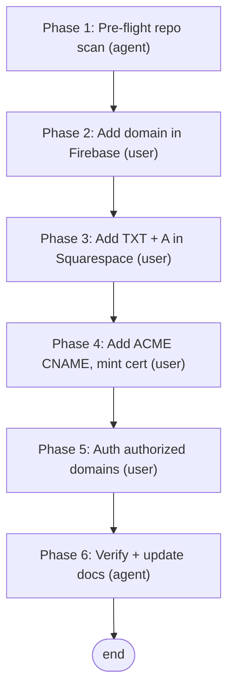

# MCMP Chatbot — Custom Domain Workflow

Replace the auto-generated App Hosting URL (`https://mcmp-chatbot--mcmp-firebase.us-east4.hosted.app`) with a clean custom subdomain served off a domain the user owns. The auto URL shape is `<backend-id>--<project-id>.<region>.hosted.app`: only the **backend-id** prefix is editable (and only at backend-creation time), while `--mcmp-firebase.us-east4.hosted.app` is permanent — so a genuinely clean address requires a **custom domain**, not a console rename.

This workflow records the live process used to connect **`mcmp-chat.ignacioojea.com`**. The domain is registered through **Squarespace** (where Google Domains migrated), so the DNS steps are Squarespace-specific; the Firebase steps generalize to any App Hosting backend.

**Key result: no code changes are needed.** The frontend reaches its API with **relative paths** (`/api/...`), which follow whatever host serves the page, and `BACKEND_URL` is a separate server-side Cloud Run URL unaffected by the public hostname. There is **no CORS allow-origins list** and **no hardcoded `hosted.app` reference** in functional code — only in docs. The sole non-DNS change is adding the new host to **Auth → Authorized domains** (Phase 5).

**The two DNS phases (the part that trips people up).** App Hosting verifies a custom domain in two stages, each adding *different* records:

1. **Ownership + routing** — a `fah-claim` **TXT** record (proves you own the domain) plus the **A** record(s) that route traffic to App Hosting's anycast IP.
2. **Certificate minting** — once verified, Firebase shows an **`_acme-challenge_*` CNAME** pointing at `…authorize.certificatemanager.goog`. This is Google Certificate Manager proving control so it can mint the TLS cert. It lives on a *different host* than the A record, so it does **not** conflict with it.

**Generic reference (do not duplicate here):** the cross-provider Firebase DNS/custom-domain theory — anycast CDN, TXT-ownership vs routing records, CNAME-vs-A trade-offs, multi-tenant SAN certs, authorized-domains — lives in the knowledge base at `kb_mcp://content/reference/FIREBASE_DEFINITIONS_REF.md` § *DNS & Custom Domains* and `kb_mcp://content/workflows/APP_HOSTING_DEPLOY_WORKFLOW.md`. This doc is the MCMP-specific instance.

**Prerequisites:**
- User owns `ignacioojea.com` and can edit DNS at Squarespace (Settings → Domains → DNS Settings).
- App Hosting backend `mcmp-chatbot` is live and healthy (see [MCMPCHAT_FIREBASE_DEPLOY_WORKFLOW.md](MCMPCHAT_FIREBASE_DEPLOY_WORKFLOW.md)).
- Firebase console access as `ignacioojea@gmail.com`. **Browser/DNS clicks are the user's to perform**; the agent does the repo scan, DNS verification, and doc updates.

**Referenced artifacts:** [../firebase/frontend/apphosting.yaml](../firebase/frontend/apphosting.yaml) (frontend runtime config — `BACKEND_URL` etc.), [../firebase/frontend/src](../firebase/frontend/src) (relative-path `fetch` calls).

---

## Flow



Linear. Phases 2–5 are user console/DNS actions; Phases 1 and 6 are agent work. The two DNS phases (3 = ownership/routing, 4 = certificate) are sequential because Firebase only reveals the ACME-challenge CNAME *after* the TXT+A records verify.

---

## Phase 1 — Pre-flight repo scan (agent)

Confirm a host change breaks nothing before the user touches the console.

```bash
# Hardcoded auto-URL references (expect: only README/docs, never functional code)
grep -rni "hosted.app" . --include="*.py" --include="*.ts" --include="*.tsx" \
  --include="*.js" --include="*.json" --include="*.yaml" --include="*.html" \
  | grep -v node_modules

# CORS / allow-origins (expect: none — the app has no origin allowlist)
grep -rni "allow_origin\|CORSMiddleware\|allowed_origins" . --include="*.py" | grep -v node_modules

# Frontend API calls (expect: all relative "/api/..." — host-independent)
grep -rni 'fetch(\|API_BASE\|baseURL' firebase/frontend/src | grep -v node_modules
```

If anything functional references the old host (absolute URL, CORS origin, env var), note it for a fix in Phase 6 before the cutover. As of 2026-06-24 the scan was clean — only `README.md` and `docs/` mention the URL.

---

## Phase 2 — Add the custom domain in Firebase (user)

Firebase Console → project **mcmp-firebase** → **App Hosting** → backend **mcmp-chatbot** → **Settings** tab → **Domains** → **Add custom domain** → **Connect new domain** → enter `mcmp-chat.ignacioojea.com`.

> The custom-domain action is **not** a top-level "Domains" tab in every console version — it lives under the backend's **Settings** tab (or a ⋮ overflow menu). Do **not** "create a backend" — `mcmp-chatbot` already exists; a prompt to create one means you are in the wrong project or in classic **Hosting** instead of **App Hosting**.

Firebase then displays the **Phase 3** records (one TXT + one or more A). Leave this screen open to copy the values.

---

## Phase 3 — Add ownership + routing records in Squarespace (user)

Squarespace → **Settings → Domains → ignacioojea.com → DNS Settings → Custom Records → Add Record**. Add exactly what Firebase showed:

| Type | Name (host) | Data / Value | TTL |
|:---|:---|:---|:---|
| `A` | `mcmp-chat` | the App Hosting IP from Firebase (e.g. `35.219.200.205`) | 4 hrs |
| `TXT` | `mcmp-chat` | `fah-claim=…` (verbatim, incl. quotes if shown) | 4 hrs |

**Squarespace gotchas:**
- In the **Name** field enter only the prefix `mcmp-chat` — Squarespace appends `.ignacioojea.com` automatically.
- **Leave the DNS Presets block alone** (`A @ → 198.49.23.144`, `CNAME www → ext-sq.squarespace.com`). Those serve the apex site and are unrelated to the subdomain.
- A lower TTL (1 hr if offered) speeds up fixing a typo; otherwise 4 hrs is fine. TTL never affects whether it works.

Back in Firebase, the domain shows **"DNS changes not yet detected"** until its poller re-checks — this lags the real DNS state and is harmless. Verify the records are actually live (Phase 6 lookups) and click **Verify records**.

---

## Phase 4 — Certificate validation CNAME (user)

After the TXT+A verify, Firebase status becomes **"Needs setup" / "Minting certificate"** and reveals a second record — the ACME challenge for Google Certificate Manager:

| Type | Name (host) | Data / Value | TTL |
|:---|:---|:---|:---|
| `CNAME` | `_acme-challenge_<token>.mcmp-chat` | `<uuid>.<n>.authorize.certificatemanager.goog.` | 4 hrs |

Example used here: name `_acme-challenge_3bf472zqqwby6fxh.mcmp-chat`, value `c2f8ffba-5293-4282-a084-6554ccad9c96.5.authorize.certificatemanager.goog.`

**Why this is NOT the A/CNAME conflict you may have hit earlier:** DNS forbids a CNAME coexisting with an A record *on the same host* — trying to add a CNAME on `mcmp-chat` itself fails with *"This record conflicts with existing records."* This CNAME is on the distinct host `_acme-challenge_<token>.mcmp-chat`, so it saves cleanly alongside the A record. **Keep the A and TXT records; do not replace them.**

Then click **Verify records**. Status moves to **"Minting certificate. This may take up to 24 hours."** — fully automated on Google's side; for already-propagated records it is usually far faster. The old `.hosted.app` URL keeps serving throughout, so there is zero downtime.

---

## Phase 5 — Auth authorized domains (user) ⚠️ critical

Firebase Console → **Authentication → Settings → Authorized domains → Add domain** → `mcmp-chat.ignacioojea.com`.

This is in **Authentication**, not App Hosting, and not Squarespace. Skip it and the page loads on the new host but Google sign-in throws `auth/unauthorized-domain`. Can be done immediately — it does not depend on the cert finishing.

---

## Phase 6 — Verify + update docs (agent)

**DNS propagation** — confirm each record resolves on public resolvers before trusting Firebase's poller:

```bash
dig +short @8.8.8.8 mcmp-chat.ignacioojea.com A      # → the App Hosting IP
dig +short @8.8.8.8 mcmp-chat.ignacioojea.com TXT    # → "fah-claim=…"
dig +short @8.8.8.8 _acme-challenge_<token>.mcmp-chat.ignacioojea.com CNAME  # → …certificatemanager.goog.
```

**TLS / reachability** — once the cert mints (HTTPS fails with `SSL_ERROR_SYSCALL` until then; that means "still minting", not a misconfiguration):

```bash
curl -sS -o /dev/null -w "HTTP %{http_code}  TLS-verify %{ssl_verify_result}\n" -L https://mcmp-chat.ignacioojea.com
echo | openssl s_client -connect mcmp-chat.ignacioojea.com:443 -servername mcmp-chat.ignacioojea.com 2>/dev/null \
  | openssl x509 -noout -issuer -dates
```

Expect `HTTP 200`, `TLS-verify 0`, and a valid (Google-issued) cert. Confirm Google sign-in works on the new host.

**Docs** — update the live-URL references to the new domain and close the task:
- [../README.md](../README.md) (live URL + deploy section)
- [MCMPCHAT_FIREBASE_DEPLOY_WORKFLOW.md](MCMPCHAT_FIREBASE_DEPLOY_WORKFLOW.md) (live URL + verify curl)

---

## Key facts

| Item | Value |
|:---|:---|
| New custom domain | `mcmp-chat.ignacioojea.com` |
| Old auto URL (still works) | `mcmp-chatbot--mcmp-firebase.us-east4.hosted.app` |
| App Hosting backend / project / region | `mcmp-chatbot` / `mcmp-firebase` / `us-east4` |
| Registrar / DNS host | Squarespace (ex-Google Domains) |
| Routing record | `A  mcmp-chat → <App Hosting IP>` |
| Ownership record | `TXT  mcmp-chat → fah-claim=…` |
| Cert-validation record | `CNAME  _acme-challenge_<token>.mcmp-chat → …certificatemanager.goog.` |
| Code changes required | **None** (relative `/api/...` fetches; no CORS allowlist) |
| Auth change required | Add host to **Authentication → Authorized domains** |

---

## Quick Reference Checklist

- [ ] Pre-flight scan clean — no functional `hosted.app` / CORS / absolute-URL references (Phase 1)
- [ ] Domain added in Firebase App Hosting → Settings → Domains (Phase 2)
- [ ] `A` + `TXT` records added in Squarespace; DNS Presets untouched (Phase 3)
- [ ] Records resolve on `8.8.8.8`; **Verify records** clicked
- [ ] `_acme-challenge_*` CNAME added (distinct host — no conflict); cert minting (Phase 4)
- [ ] `mcmp-chat.ignacioojea.com` added to **Auth → Authorized domains** (Phase 5)
- [ ] `https://mcmp-chat.ignacioojea.com` returns 200 with a valid cert; Google sign-in works (Phase 6)
- [ ] README + deploy workflow updated to the new URL; `todo.custom_domain` closed

---

## Troubleshooting

| Symptom | Cause | Fix |
|:---|:---|:---|
| "This record conflicts with existing records" when adding a CNAME on `mcmp-chat` | DNS forbids A + CNAME on the same host | Don't add a CNAME on `mcmp-chat`; the ACME CNAME goes on `_acme-challenge_<token>.mcmp-chat` (a different host) |
| Firebase: "DNS changes not yet detected" though records are saved | Firebase poller lags real DNS state | Confirm with `dig @8.8.8.8`; click **Verify records** again shortly |
| `https://` fails with `SSL_ERROR_SYSCALL` / no cert | Certificate still minting | Wait — automated; up to 24h but usually far less for propagated records |
| Page loads but Google sign-in fails (`auth/unauthorized-domain`) | New host not in authorized domains | Add it under **Authentication → Settings → Authorized domains** (Phase 5) |
| Console prompts to "create a backend" | Wrong project, or in classic **Hosting** not **App Hosting** | Switch project selector to `mcmp-firebase`; open **App Hosting** — `mcmp-chatbot` already exists |
| Squarespace strips/keeps the trailing `.` on the CNAME value | Provider normalization | Harmless — both forms resolve correctly |

---

## Notes

The auto-generated `.hosted.app` URL is **not** retired by this process — it keeps serving in parallel. To make the custom domain *the* canonical address, update outward-facing references (README, any links shared with users) but no redirect is required. Apex domains (`ignacioojea.com` itself) are supported by App Hosting but verify/provision more slowly than a subdomain and would collide with the Squarespace DNS Presets serving the main site — the subdomain approach used here avoids that entirely.
