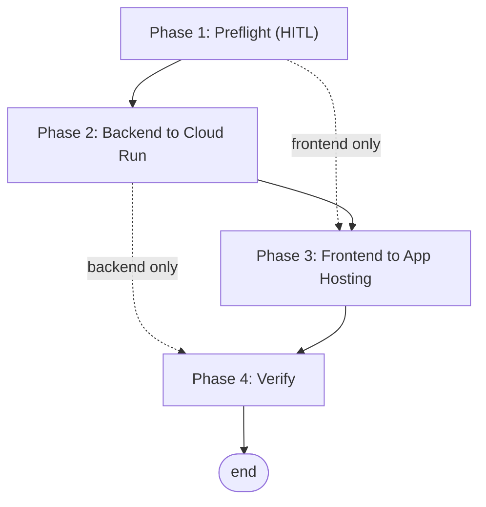

# MCMP Chatbot — Firebase Deploy Workflow

The production app is a two-part Firebase stack, and each part deploys by a different mechanism: the **FastAPI backend** ships to **Cloud Run** through the `deploy-backend.sh` script, and the **Next.js frontend** ships to **Firebase App Hosting** via a git push (auto-rollout) or a manual rollout. Both deploy from the **`firebase-branch`** branch. This workflow sequences a safe deploy of either or both parts: confirm preflight state, deploy the backend, roll out the frontend, then verify the live stack.

It reflects the *live* deployment. Where it disagrees with [FIREBASE_MIGRATION_PLAN.md](FIREBASE_MIGRATION_PLAN.md) (the original blueprint), this workflow wins — the plan has drifted on the operating account (`ignacioojea@gmail.com`, not `eikasia@eikasia.com`) and the App Hosting region (`us-east4`).

**Live URL:** https://mcmp-chatbot--mcmp-firebase.us-east4.hosted.app

**Execution model:** mixed — a linear preflight + verify wrapping two independent deploy tracks (backend, frontend) that may run in either order or on their own.

**Prerequisites:**
- Authenticated as **`ignacioojea@gmail.com`** in both `gcloud` (`gcloud auth list`) and the Firebase CLI (`firebase login:list`).
- On the **`firebase-branch`** branch (`deploy-backend.sh` has a hard branch guard).
- Firebase CLI installed (`firebase --version`, tested with 15.x). Local Node version is irrelevant — the frontend builds in the cloud App Hosting buildpack.

**Referenced artifacts:** [../firebase/backend/deploy-backend.sh](../firebase/backend/deploy-backend.sh) (backend build + deploy), [../firebase/frontend/apphosting.yaml](../firebase/frontend/apphosting.yaml) (frontend runtime config).

---

## Flow



Phase 1 is a human-gated preflight that also picks scope (both / backend-only / frontend-only). The two deploy tracks (P2, P3) are independent — skip either per scope — and Phase 4 verifies whatever was deployed.

---

## Phase 1 — Preflight & scope

```yaml
hitl_gate: true
```

Confirm the deploy is safe and decide what to ship. Because this pushes to production (outward-facing, hard to reverse), a human approves scope before any deploy runs — especially when the branch is already pushed and nothing has changed since the last deploy.

### Step 1.1 — Verify identity and branch

```bash
gcloud auth list                 # active account must be ignacioojea@gmail.com
firebase login:list              # must show ignacioojea@gmail.com
git rev-parse --abbrev-ref HEAD  # must be firebase-branch
git status                       # note uncommitted changes (deploy ships current HEAD)
```

The gcloud *active project* does not matter — every command passes `--project mcmp-firebase` explicitly.

### Step 1.2 — Choose scope

Decide which tracks to run: **both**, **backend only** (Phase 2), or **frontend only** (Phase 3). If the working tree is clean and in sync with `origin/firebase-branch`, a deploy re-ships the already-committed code — confirm that is intended.

---

## Phase 2 — Backend to Cloud Run

Build the backend image via Cloud Build (from repo root, so the Dockerfile can `COPY src/`) and deploy it to the IAM-only Cloud Run service. The script enforces the branch guard, mounts secrets, sets `DATA_BACKEND=firestore`, and smoke-tests `/health`.

### Step 2.1 — Run the deploy script

```bash
git checkout firebase-branch
./firebase/backend/deploy-backend.sh
```

A successful run ends with `{"status":"ok","data_backend":"firestore"}` and prints the service URL. Takes ~2–4 minutes (Cloud Build ~1.5 min plus the Cloud Run revision).

---

## Phase 3 — Frontend to App Hosting

Roll out the Next.js frontend from `firebase-branch` HEAD. The buildpack build runs in the cloud; traffic swaps to the new build automatically when it completes.

### Step 3.1 — Push-to-deploy (normal path)

App Hosting watches `firebase-branch` and auto-rolls-out on every push:

```bash
git checkout firebase-branch
git push origin firebase-branch
```

### Step 3.2 — Manual rollout (nothing new to push)

When the branch is already pushed and you need to force a rebuild from current HEAD:

```bash
firebase apphosting:rollouts:create mcmp-chatbot \
  --git-branch firebase-branch --project mcmp-firebase --force
```

Track progress in the [Firebase Console → App Hosting](https://console.firebase.google.com/project/mcmp-firebase/apphosting). Public-by-design frontend config (`BACKEND_URL`, `NEXT_PUBLIC_FB_API_KEY`, `NEXT_PUBLIC_ALLOWED_ADMIN_EMAILS`) lives in `firebase/frontend/apphosting.yaml` — edit there, commit, and push to apply.

---

## Phase 4 — Verify

Confirm the live stack responds for whatever was deployed.

### Step 4.1 — Frontend reachability

```bash
curl -s -o /dev/null -w "%{http_code}\n" https://mcmp-chatbot--mcmp-firebase.us-east4.hosted.app/   # expect 200
```

### Step 4.2 — Backend health (IAM token required)

The backend is `--no-allow-unauthenticated`, so it needs an identity token:

```bash
TOKEN=$(gcloud auth print-identity-token)
curl -fsS -H "Authorization: Bearer $TOKEN" \
  https://mcmp-firebase-backend-113682704284.us-central1.run.app/health   # expect {"status":"ok",...}
```

---

## Decision Points & Branches

| Condition | Action |
|:---|:---|
| Scope is backend only | Run Phase 2, skip Phase 3 |
| Scope is frontend only | Skip Phase 2, run Phase 3 |
| Branch clean and pushed, frontend rollout wanted | Use Phase 3 Step 3.2 (manual rollout) — a push alone triggers nothing |
| Uncommitted changes present | `deploy-backend.sh` warns and ships current HEAD; commit first if that is not intended |

---

## Key infrastructure

| Component | Value |
|:---|:---|
| GCP project | `mcmp-firebase` |
| Operating account | `ignacioojea@gmail.com` |
| Cloud Run backend | `mcmp-firebase-backend` (us-central1, IAM-only) |
| Backend runtime SA | `mcmp-firebase-app-sa@mcmp-firebase.iam.gserviceaccount.com` |
| App Hosting backend | `mcmp-chatbot` (us-east4) |
| Connected repo | `IgnacioOQ/mcmp_chatbot`, branch `firebase-branch` |
| Artifact Registry | `us-central1-docker.pkg.dev/mcmp-firebase/mcmp-firebase-app` |
| Secrets (Secret Manager) | `GEMINI_API_KEY`, `SHEETS_SA_JSON`, `SHEETS_ID`, `BACKEND_URL` |

---

## Quick Reference Checklist

- [ ] Identity confirmed as `ignacioojea@gmail.com` (gcloud + firebase) and on `firebase-branch`
- [ ] Scope chosen and approved (both / backend / frontend)
- [ ] Backend deployed — `/health` smoke test returned `{"status":"ok","data_backend":"firestore"}`
- [ ] Frontend rollout created (push or manual) and completed in the console
- [ ] Live site returns 200; backend `/health` returns 200 with an IAM token

---

## Troubleshooting

| Symptom | Cause | Fix |
|:---|:---|:---|
| `deploys must run on 'firebase-branch'` | Branch guard tripped | `git checkout firebase-branch` before running the script |
| Frontend unchanged after `git push` | No new commit, so no auto-rollout | Use the manual rollout (Step 3.2) |
| Backend `/health` returns 401/403 | Service is IAM-only and no token sent | Pass `Authorization: Bearer $(gcloud auth print-identity-token)` |
| Need to roll back the frontend | Bad rollout live | `firebase apphosting:rollouts:create mcmp-chatbot --git-commit <good-sha> --project mcmp-firebase` |
| Need to roll back the backend | Bad revision serving traffic | `gcloud run services update-traffic mcmp-firebase-backend --to-revisions=<rev>=100 --region=us-central1 --project=mcmp-firebase` |

---

## Notes

Data refresh is **separate** from deploy: Firestore is repopulated by a weekly scheduled cloud agent on the **`routines`** branch (runs `scripts/refresh_dataset.sh`), not by this workflow. See [FIREBASE_MIGRATION_PLAN.md](FIREBASE_MIGRATION_PLAN.md) and the project README.
